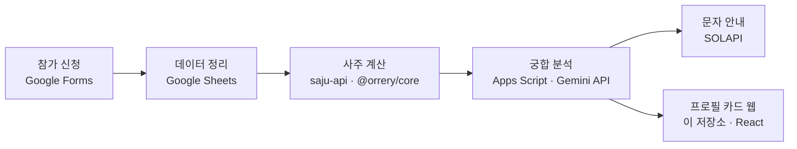

# Profile Web

> 사주 궁합으로 어울리는 상대를 매칭해주는 이벤트의 **프로필 카드 웹**

참가자별 프로필 카드를 보여주는 React 웹입니다.
운영 자동화·궁합 분석은 Google Apps Script에서, 사주 계산은 별도 서버리스 API([`saju-api`](https://github.com/daeun0726/saju-api))에서 처리하며, 이 저장소는 **프론트엔드(프로필 카드 UI)** 를 담당합니다.

## 🔎 접속 방식

이 웹은 **참가자별 개인 프로필 페이지**입니다. 각 참가자에게 발급된 개인 링크로 접속합니다.

```
https://saju-front-nu.vercel.app/profile/{참가자ID}
```

> ⚠️ 루트 주소(`/`)에는 프로필이 없습니다. 반드시 `/profile/{id}` 형태의 개인 링크로 접속해야 카드가 표시됩니다.

## 🔐 개인정보 처리 · 상시 데모를 제공하지 않는 이유

이벤트에서 참가자의 개인 정보를 다루기 때문에, **개인정보를 보관하지 않는 것을 원칙**으로 운영했습니다.

- 매 회차 종료 후 시트의 과거 참가자 데이터를 **파기**합니다.
- 이 정책상 **상시 접속 가능한 데모 링크는 제공하지 않습니다.**

## 🧩 전체 흐름



## 🛠️ Tech Stack

**이 저장소 (Frontend)**
`React` · `TypeScript` · `Vercel`

**연동 (별도)**
`Google Apps Script` — 운영 자동화 · Gemini API 궁합 분석
[`saju-api`](https://github.com/daeun0726/saju-api) — 사주 계산 · `@orrery/core`
`SOLAPI` — 결과 문자 발송
